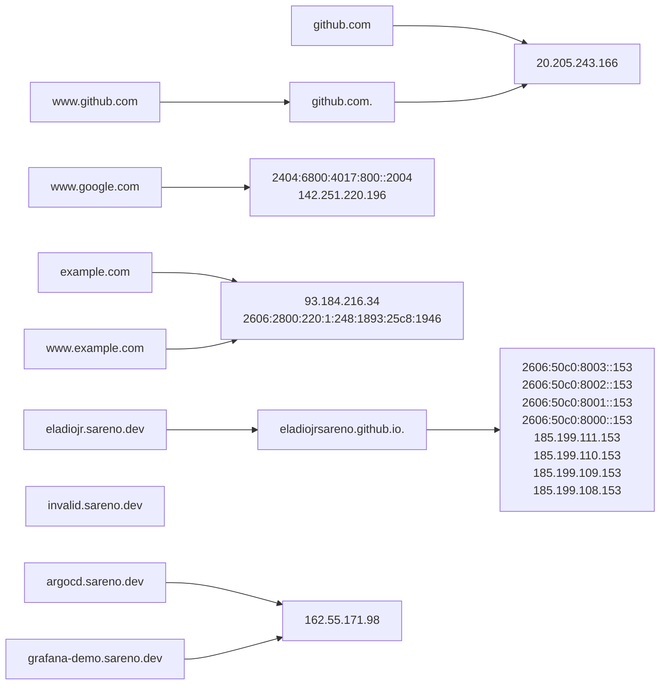

# ginamus
Utility tool for mapping domains and their corresponding targets. It accepts a list of domains and then creates a graph output.

## Go
Requires version 1.20+

## Usage
```shell
$ go build -o ginamus main.go
$ ./ginamus -f domains.txt
$ markdown OUTPUT.md
```

## Output
The output is a [Markdown](https://www.markdownguide.org/) file named `OUTPUT.md`.

## Preview
The diagram is based on [Mermaid](https://mermaid.js.org/). To preview the output, you can use the Visual Code Extension [Markdown Preview Mermaid Support](https://marketplace.visualstudio.com/items?itemName=bierner.markdown-mermaid), Online renderer such as [https://mermaid.live/](https://mermaid.live/), or push it to GitHub (GitHub supports Mermaid for rendering diagram).

## Sample
If you run the following:
```shell
$ cat <<EOT > domains.txt
github.com
www.github.com
www.google.com
example.com
www.example.com
eladiojr.sareno.dev
invalid.sareno.dev
argocd.sareno.dev
grafana-demo.sareno.dev
EOT
$ ./ginamus -f domains.txt
```
you will get the following content for `OUTPUT.md`:
```
flowchart LR
c2208abde9668e8e9815c3690855edd1e63abeac[github.com] --> bbe275b8d64b6d44ca49d3e1387197e655e27edd[20.205.243.166]
a2999f4b523d4e63066ad0d9f401fe9316265a0f[www.github.com] --> 675f61152ff93b424ad6bcb5148b2d6688b6decd[github.com.] --> bbe275b8d64b6d44ca49d3e1387197e655e27edd[20.205.243.166]
d8b99f68b208b5453b391cb0c6c3d6a9824f3c3a[www.google.com] --> be4b9b1abb21bdd5c0b58b19bad84f0b9dea20aa[2404:6800:4017:800::2004<br/>142.251.220.196]
0caaf24ab1a0c33440c06afe99df986365b0781f[example.com] --> 97d24b20dedcf7a1210662ef50d8b439bd01f165[93.184.216.34<br/>2606:2800:220:1:248:1893:25c8:1946]
068503358dddd23cf6cf00f5d6ad9a45cd0a8e03[www.example.com] --> 97d24b20dedcf7a1210662ef50d8b439bd01f165[93.184.216.34<br/>2606:2800:220:1:248:1893:25c8:1946]
fc57c6ecf2502d38e0fc9fd4ce1f7f30cd40f71e[eladiojr.sareno.dev] --> da9731c806bcb0fba02f4820a46b061adc3df51a[eladiojrsareno.github.io.] --> 0ed1b375f0003967700ef8a914c328013ebdcd1a[2606:50c0:8003::153<br/>2606:50c0:8002::153<br/>2606:50c0:8001::153<br/>2606:50c0:8000::153<br/>185.199.111.153<br/>185.199.110.153<br/>185.199.109.153<br/>185.199.108.153]
39f8fd81dcdf82aed93583cedf06a46010a40f00[invalid.sareno.dev]
ba272326edb644027bb6dae8a4f9b73ac3c6ed1b[argocd.sareno.dev] --> 224493ad38c3dfac48b3635484a65da824597c1d[162.55.171.98]
a6d6ce2405399c42240cd05ead178f2519d439e5[grafana-demo.sareno.dev] --> 224493ad38c3dfac48b3635484a65da824597c1d[162.55.171.98]
```
and if you preview it, you'll get the following Mermaid diagram:


