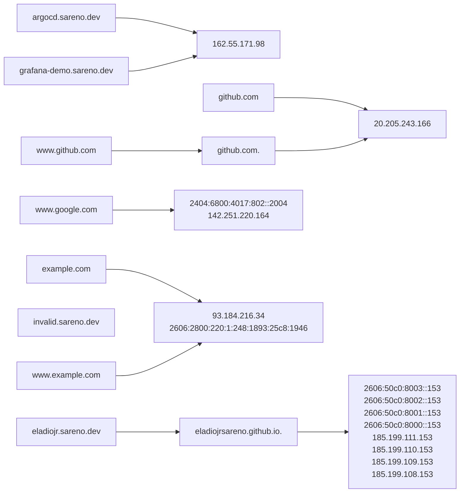

# ginamus
Utility tool for mapping domains and their corresponding targets. It accepts a list of domains and then creates a graph output.

## Go
Requires version 1.20+

## Usage
```shell
$ go build -o ginamus main.go
$ ./ginamus -f domains.txt
$ markdown OUTPUT.md
```

## Output
The output is a [Markdown](https://www.markdownguide.org/) file named `OUTPUT.md`.

## Preview
The diagram is based on [Mermaid](https://mermaid.js.org/). To preview the output, you can use the Visual Code Extension [Markdown Preview Mermaid Support](https://marketplace.visualstudio.com/items?itemName=bierner.markdown-mermaid), Online renderer such as [https://mermaid.live/](https://mermaid.live/), or push it to GitHub (GitHub supports Mermaid for rendering diagram).

## Sample
If you run the following:
```shell
$ cat <<EOT > domains.txt
github.com
www.github.com
www.google.com
example.com
www.example.com
eladiojr.sareno.dev
invalid.sareno.dev
argocd.sareno.dev
grafana-demo.sareno.dev
EOT
$ ./ginamus --file domains.txt
```
you will get the following content for `OUTPUT.md`:
```
flowchart LR
c2208[github.com] --> bbe27[20.205.243.166]
a2999[www.github.com] --> 675f6[github.com.] --> bbe27[20.205.243.166]
d8b99[www.google.com] --> cb7e1[2404:6800:4017:802::2004<br/>142.251.220.164]
0caaf[example.com] --> 97d24[93.184.216.34<br/>2606:2800:220:1:248:1893:25c8:1946]
06850[www.example.com] --> 97d24[93.184.216.34<br/>2606:2800:220:1:248:1893:25c8:1946]
fc57c[eladiojr.sareno.dev] --> da973[eladiojrsareno.github.io.] --> 0ed1b[2606:50c0:8003::153<br/>2606:50c0:8002::153<br/>2606:50c0:8001::153<br/>2606:50c0:8000::153<br/>185.199.111.153<br/>185.199.110.153<br/>185.199.109.153<br/>185.199.108.153]
39f8f[invalid.sareno.dev]
ba272[argocd.sareno.dev] --> 22449[162.55.171.98]
a6d6c[grafana-demo.sareno.dev] --> 22449[162.55.171.98]
```
and if you preview it, you'll get the following Mermaid diagram:


